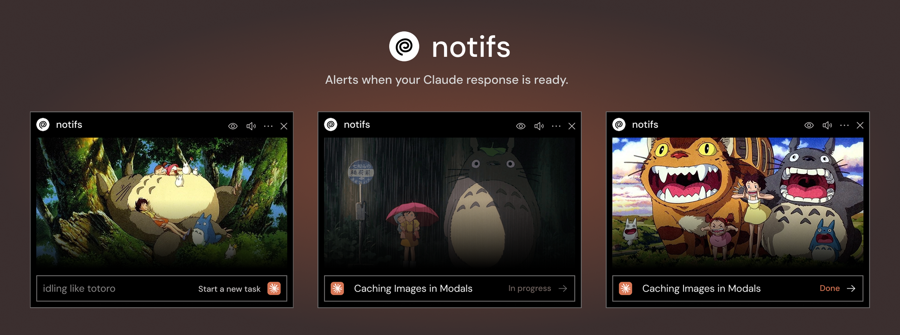

# notifs (v0.11.1)



## Overview
A Chrome extension that notifies you when Claude is done with its response. You can keep doing other stuff without having to worry if Claude is done or not. 

It will notify you with:
- Desktop notification
- Cute Totoro-themed sound

You can also monitor the chat status through the extension's UI and customize the experience to your liking.

https://github.com/user-attachments/assets/fc447a6a-336a-49ab-8540-e888ede6e754

## Note
The extension handles one chat session per browser window. To monitor multiple Claude chat sessions, open each chat in a different window.

## Development
I made this to make my life easier since I use Claude a lot, and I thought it'd be fun to build. Though this was enjoyable, testing extensions is really a pain. 

I'd like to continue improving this with more customization options and support for different AI chats, but that'll have to wait. 

If you'd like to see something added to the extension, please reach out or open an issue. Even better, contribute to this yourself—I'd love to see that!


## Repo Layout
- `src/background.ts` → background service worker
- `src/content-script.ts` → detects "Send"/"Regenerate" on the chat tab
- `popup/` → React/Vite/Tailwind popup source code
- `dist/` → build output
- `manifest.json` → extension manifest

## Popup (UI) Setup
1. `cd popup`
2. `npm install` 
3. `npm run dev` to test the popup in isolation (opens localhost:5173)
   - There is a commented out test handler in main.tsx that you can use to test the UI.
4. `npm run build` to output to `dist/popup` and `dist/sounds`

## Build, Install & Use
1. From repo root:  
   ```bash
   npm install       
   npm run build     
   ```
2. Open Chrome and navigate to `chrome://extensions/`
3. Enable "Developer mode" by toggling the switch in the top right corner
4. Click "Load unpacked" button
5. Select the entire project folder (the one containing `manifest.json` and the `dist` folder)
6. The extension should now appear in your extensions list and be ready to use
7. Navigate to Claude.ai and start chatting - you'll receive notifications when Claude finishes responding!
